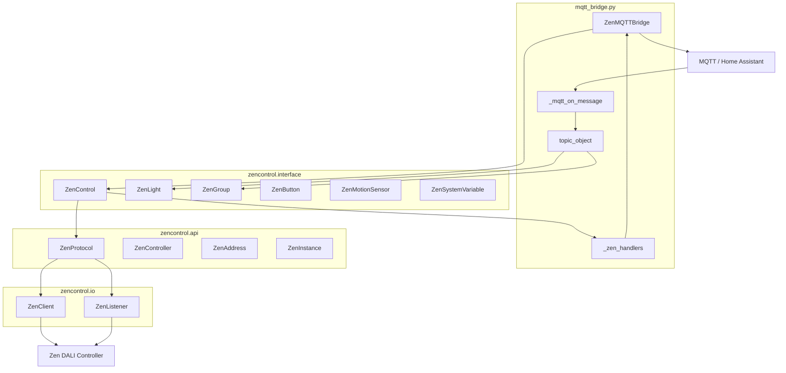

# The Zencontrol protocol

**Role:** A long-running bridge that connects Zen DALI lighting controllers to Home Assistant via MQTT. It performs auto-discovery of DALI entities, creates Home Assistant MQTT auto-discovery entities, and keeps state in sync in both directions.

# Intents

## (a) Intent as standalone server: `examples/mqtt_bridge.py`

**Role:** A long-running bridge that connects Zen DALI lighting controllers to Home Assistant via MQTT. It performs auto-discovery of DALI entities, creates Home Assistant MQTT auto-discovery entities, and keeps state in sync in both directions.

**Flow:**

1. **Bootstrap:** Load `config.yaml` (path currently hardcoded) and set up logging.
2. **Zen stack:** Build a single `ZenControl` instance; for each entry in `zencontrol` add a controller with `zen.add_controller(id, name, label, host, port, mac)`. Register bridge methods as Zen callbacks: `profile_change`, `group_change`, `light_change`, `button_press`, `button_long_press`, `motion_event`, `system_variable_change`.
3. **MQTT:** Start `_mqtt_message_handler()` (reconnect loop). Subscribe to command topics under `discovery_prefix` for each controller (light, binary_sensor, sensor, switch, event, select, device_automation). Publish availability per controller.
4. **Ready wait:** For each controller, poll `is_controller_ready()` then run `interview()` (label, version, current profile).
5. **Discovery:** Run setup in order: profiles → lights → groups → buttons → motion sensors → system variables. For each entity type, call `_client_data_for_object()` (builds HA device/unique_id and `mqtt_topic`), publish config to `.../config`, store the entity in `topic_object[base_topic]` for later command routing. Delete any retained config topics that were from a previous run.
6. **Events:** Call `zen.start()` to begin event monitoring (ZenListener + protocol callbacks). Then dump controller/lights/groups to `examples/dump.yaml` and cache to `examples/cache.pkl`, and enter an infinite sleep loop.

**Data flow:**

- **HA → Zen:** MQTT message on `.../set` → `_mqtt_on_message` → lookup `topic_object[base_topic]` → dispatch to `_mqtt_profile_change`, `_mqtt_light_change`, `_mqtt_groupscene_change`, `_mqtt_system_variable_change` → library calls (`ctrl.switch_to_profile()`, `light.set()`, `group.set_scene()`, `sysvar.set_value()`).
- **Zen → HA:** Controller emits TPI events → `ZenProtocol` parses and invokes callbacks → bridge `_zen_*` handlers build MQTT state/event payloads and call `_publish_state` / `_publish_event`.

**Notable details:**

- Entity–topic mapping lives in the bridge (`topic_object`, `client_data` on each entity). The library does not know about MQTT; it only exposes entities and callbacks.
- Rate limiting (`RateLimiter`) is used when refreshing light state in bulk to avoid overloading the controller.
- Cache is loaded/saved from `examples/cache.pkl`; dump is always written to `examples/dump.yaml`.

---

## (b) Intent as a communications library for Home Assistant integration

The library is explicitly layered so that **higher layers do not deal with wire format**, and the **top layer is intended for “control interface or home automation”** (from [zencontrol/interface/interface.py](zencontrol/interface/interface.py)).

**Layers (from comments in [README.md](README.md) and [zencontrol/init.py](zencontrol/__init__.py)):**

| Layer                          | Module                 | Purpose                                                                                                                                                                                                                                                                                                                          |
| ------------------------------ | ---------------------- | -------------------------------------------------------------------------------------------------------------------------------------------------------------------------------------------------------------------------------------------------------------------------------------------------------------------------------- |
| **zen_io** (wire)              | `zencontrol.io`        | Raw TPI Advanced UDP: `ZenClient` (request/response), `ZenListener` (multicast/unicast events), `Request`/`Response`/`ZenEvent`. Packet framing and checksums.                                                                                                                                                                   |
| **zen_api** (TPI API)          | `zencontrol.api`       | TPI Advanced API: `ZenProtocol` (sends commands via `ZenClient`, parses events from `ZenListener`), `ZenController`, `ZenAddress`, `ZenInstance`, `ZenColour`, `ZenProfile`, and types. No “smart building” concepts.                                                                                                            |
| **zen_interface** (high-level) | `zencontrol.interface` | Opinionated facade: `ZenControl` plus entities `ZenLight`, `ZenGroup`, `ZenButton`, `ZenMotionSensor`, `ZenSystemVariable`, and subclasses of `ZenController`/`ZenProfile`. Methods like `get_lights()`, `get_groups()`, `get_buttons()`, etc., and **callbacks** for profile/group/light/button/motion/system variable changes. |

**Integration pattern:**

- Create `ZenControl(logger=..., print_traffic=..., cache=...)`, then `add_controller(id, name, label, host, port, mac)` for each controller.
- Assign async callbacks (e.g. `zen.light_change = my_light_handler`, `zen.button_press = my_button_handler`).
- Call `await zen.start()` to start event monitoring (callbacks fire when the controller sends TPI events).
- Use `get_profiles()`, `get_lights()`, `get_groups()`, `get_buttons()`, `get_motion_sensors()` and optional `get_system_variables()` to enumerate entities; then call methods on them (`light.set(level=…)`, `light.on()`, `group.set_scene(label)`, `ctrl.switch_to_profile(profile)`).

The MQTT bridge is **one consumer** of this API. A **native Home Assistant integration** (custom component) could use the same `ZenControl` + callbacks and push state into HA via the integration API instead of MQTT; the library does not depend on MQTT or HA.

**Public API surface:** Exported from [zencontrol/**init**.py](zencontrol/__init__.py): `ZenControl`, `ZenLight`, `ZenGroup`, `ZenButton`, `ZenMotionSensor`, `ZenSystemVariable`, `ZenController`, `ZenAddress`, `ZenInstance`, `ZenProtocol`, `ZenColour`, `ZenProfile`, `ZenClient`, `ZenListener`, `ZenEvent`, request/response types, exceptions, and type enums.

---

## Architecture diagram (data flow)

---

## Opportunities for improvement and simplification

**1. Config and paths**

- Config path is hardcoded as `examples/config.yaml`; cache and dump are hardcoded under `examples/`. Making these configurable (e.g. CLI args or config keys) would allow running the bridge from any CWD and avoid committing example paths into production.
- README says “config.json” but the code uses YAML; correct README to “config.yaml”.

**2. Config validation vs example**

- `setup_config()` requires `id` in every `zencontrol` entry, but [examples/config-example.yaml](examples/config-example.yaml) does not show `id`. Either add `id` to the example and document it, or make `id` optional and derive it (e.g. from list index or name).

**3. Bridge size and structure**

- [examples/mqtt_bridge.py](examples/mqtt_bridge.py) is ~1050 lines. Consider extracting: (a) HA discovery/publishing helpers (topic building, config dicts), (b) conversion helpers (`arc_to_brightness`, `brightness_to_arc`, `kelvin_to_mireds`, `mireds_to_kelvin`) into a small module or class, (c) command dispatch (`_mqtt_on_message` → handlers) into a clear map so adding entity types does not grow one big if/elif chain.

**4. Library–bridge boundary**

- `client_data` is attached to library entities (e.g. `ZenLight`, `ZenGroup`) by the bridge and used in Zen callbacks to resolve `mqtt_topic`. That couples the library to “something that stores MQTT topic per entity.” A cleaner approach for reuse would be: library entities expose a stable id/label; the bridge keeps a single mapping (entity id → MQTT topic) and uses it inside its callbacks. Then the library stays free of MQTT/HA concepts.

**5. Logging vs print**

- Several `print()` calls remain (e.g. profile change, “HA asking to change profile”, “Zen to HA: profile changed”). Replacing them with `self.logger.info()` or `self.logger.debug()` would allow level control and consistent formatting.

**6. Side effects on every run**

- Writing `examples/dump.yaml` and `examples/cache.pkl` on every run may be unnecessary in production. Making dump/cache writes optional (e.g. via config or a “debug” flag) would reduce surprise and disk writes.

**7. Singleton lifecycle in interface**

- [zencontrol/interface/interface.py](zencontrol/interface/interface.py) uses `__new__` singletons for `ZenController`, `ZenProfile`, and likely other entities keyed by name/number. Recreating controllers with different configs or in tests could reuse old instances. Consider documenting the lifecycle or moving to an explicit factory/cache that can be cleared.

**8. MQTT will**

- Only one `Will` is used (first controller) due to aiomqtt; comment in code notes this. Either document as a known limitation or add a note in README.

**9. Event ordering / cascading**

- interface has commented-out “delayed” light events and “Don’t cascade groups” with short explanations. Adding a short comment or a small “Event handling” section in the library docstring would help future maintainers.

**10. Type consistency**

- [zencontrol/api/models.py](zencontrol/api/models.py) declares `ZenController.id` as `str`; the bridge passes `config['id']` (often int in YAML). Align type (e.g. accept int and convert to str, or type hint Union) and ensure config validation matches.

---

## Summary

- **Standalone server:** The bridge is a single process that wires Zen controllers to Home Assistant via MQTT: it discovers entities, keeps `topic_object` for command routing, and forwards Zen events to MQTT state/event topics.
- **Library:** The three layers (io → api → interface) are clearly separated; the interface layer is intended for home automation and exposes a callback-based API that the MQTT bridge uses and that a future native HA integration could use without MQTT.
- **Improvements:** Focus on configurable paths and config validation, smaller and more structured bridge code, decoupling MQTT/topic state from library entities, consistent logging, optional dump/cache, and clearer lifecycle and typing.

